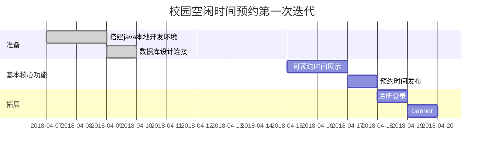
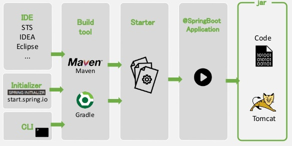

# 校园空闲时间预约

## 测试账号

管理员：admin	密码：admin

学生：111		密码：1111

教师：222		密码：2222

## 甘特图



---
## 程序结构

**SSH 集成框架**是 struts + spring + hibernate 的一个集成框架,从职责上分为四层: 表示层、业务逻辑层、数据持久层和==域模块层（实体层）==

[Spring Boot 连接 MySQL 数据库 JPA](http://www.aidansu.com/2017/spring-boot-mysql-jpa/)

 [Spring Boot快速开发REST服务最佳实践](https://www.cnblogs.com/jeffwongishandsome/p/quick-develop-rest-api-by-using-spring-boot.html)

[SSH框架总结分析](https://blog.csdn.net/shan9liang/article/details/8803989)

[关于SSH架构中Entity/Dao/Service/Controller的理解](https://www.zybuluo.com/Beeder/note/1053661)

### src/main/java/com.campus 目录：后台

#### 公共模块

common：公共类，如枚举、常量、业务无关的通用公共实体等
common.utils：常用实用的帮助类，如反射、字符串、集合、枚举、正则、缓存、队列等

#### 控制层/表现层

controller：负责页面访问控制，处理用户输入请求，并调用服务层响应用户操作。==对外暴露 Rest API 接口==

#### 数据持久层

model：实体层，本质是数据表的对象化，用对象来映射数据库表，
repository：持久化层，负责与数据库交互，提供数据表存取机制，以 ORM 框架映射对象-关系数据库。定义访问底层数据模型的接口。对数据操作的一层封装，XxxxRepository接口继承JpaRepository，因此具备通用的数据访问控制层的能力。[Repository（资源库）接口介绍](http://perfy315.iteye.com/blog/1460226)

#### 业务逻辑层

service：用于业务逻辑相关的服务
service.impl ==服务对应的实现接口==，由控制层直接调用

#### 程序入口

Application.java：包括一个静态main方法，可以做一些框架配置，比如==mybatis、swagger==等

### resources 目录：前端页面，与用户直接交互的表示层

#### static : 静态文件

static/css : CSS 样式
static/img : 图片
static/js : js 文件

#### templates : 模板文件，主要是 html 文件

admin：后台管理页面
freetime：预约相关页面
myspace：个人中心
user：用户页面
index.html：主页

#### 配置文件

application.properties : Spring Boot 自动加载的配置文件，默认为开发环境，可切换以下多环境 [HTML5日期和时间选择输入](https://www.imooc.com/article/11915)
application-dev.properties 开发环境
application-prod.properties 生产环境
application-test.properties 测试环境

### src/test/java  测试程序

### 其它文件

Spring Element

@Autowired 注解与自动装配，自定义 bean

DB：存放数据库文件

target：注解

pom.xml：添加项目所需要的依赖 [Maven pom.xml 配置详解](https://blog.csdn.net/ithomer/article/details/9332071)

README.md：项目说明

spring-boot-jpa.iml：

--------------------

## 准备

### 安装Eclipse for Java Web Developer

#### 下载JDK

[SE JDK](http://www.oracle.com/technetwork/java/javase/downloads/index.html)，选择`Java Platform (JDK) 10`，下载到`\Java\JDK`

>[EE JDK](http://www.oracle.com/technetwork/java/javaee/downloads/index.html)下载下来是`glassfish`格式，弄不太懂，发现安装`SE JDK`也是一样的

#### 设置环境变量

1. `我的电脑`->右键`属性`->`高级系统设置`->`环境变量`，下同
2. 新建***系统变量*** `JAVA_HOME`，并赋值JDK的安装路径，如：
    `D:\Develop\Java\jdk1.8.0_161`
3. 在***系统变量*** `PATH`后***追加***
    `;%JAVA_HOME%\bin;%JAVA_HOME%\jre;`

#### 下载 Eclipse 安装包

[eclipse-inst-win64.exe](https://www.eclipse.org/downloads/)
#### 运行安装软件，选择`Eclipse for Java Web Developer`并安装

>推荐所有Java相关软件全部都安装到非系统盘同一目录`\Java`下，如：
>`D:\Develop\Java`

#### 汉化

1. [Eclipse Babel Project Downloads](http://www.eclipse.org/babel/downloads.php) 
    ->Babel Language Pack Zips
    ->对应版本（如Oxygen）
    ->Language: Chinese (Simplified)
    ->[BabelLanguagePack-eclipse-zh_4.7.0.v20171231020002.zip (85.5%)](http://www.eclipse.org/downloads/download.php?file=/technology/babel/babel_language_packs/R0.15.1/oxygen/BabelLanguagePack-eclipse-zh_4.7.0.v20171231020002.zip)
2. 将`features`和`plugins`解压到`\Eclipse\dropins\`下。
3. 重启Eclipse

---
### 安装 Tomcat

#### 下载安装包

[Tomcat 9](https://tomcat.apache.org/download-90.cgi)，选择`core`下的`32/64-bit Windows zip (pgp, sha1, sha512)`，解压到`\Java\Tomcat`

#### 设置 Tomcat

1. 在 Eclipse 中，点击菜单栏 `Window->Preferences`，点击 `Server / Runtime Environments`
2. 点击 `Add`按钮， 新建一个服务器，选择`Tomcat 9.0`->`Next`
3. 在`Tomcat installation directory`->`Browse`选择Tomcat的安装目录，点击`finish`完成配置。

---
### 新建第一个 Java Web 项目并部署在Tomcat服务器

#### 新建 Java Web 项目

1. 新建->`Dynamic Web Project`
2. `Target runtime`选择安装的服务器（如：`Apache Tomcat v9.0`）
3. `module version`选择默认`3.1`，其他保持默认，`finish`。

#### 新建第一个 html 页面

在`\WebContent`目录下新建`Index.html`
```
<!DOCTYPE html>
<html>
<head>
<meta charset="UTF-8">
<title>Insert title here</title>
</head>
<body>
Hello World!<br>
This is CampusDate/WebContent/Index.html!
</body>
</html>
```
#### 部署在Tomcat服务器

在Index.html上右键->`Run as`->`Run on Server`.

---
## Spring Boot

### 安装 Spring Boot框架

#### [SpringBoot工程从创建到执行](http://rensanning.iteye.com/blog/2355933)



#### [Spring Boot 简明教程](https://www.kancloud.cn/boshu/springboot/215857)

#### 安装 [STS插件](https://spring.io/tools/sts)

- 1. 在线or离线安装
- 2. 重启

#### 端口占用错误

> The Tomcat connector configured to listen on port 8080 failed to start. The port may already be in use or the connector may be misconfigured.

> 在控制台 stop project

#### 传统的spring web项目创建过程

步骤1：配置web.xml

步骤2：配置springMVC

步骤3：配置业务bean

步骤4：配置数据访问bean

运行原理分析：web容器启动后，通过web.xml实例化web项目。
web.xml中有三个方面的重要信息：

1. 第一，servlet信息；
   servelt配置信息指明了servlet类以及该servlet拦截的url模式。
2. 第二，spring的配置信息；
   spring配置信息指明了spring容器启动时需要加载的功能bean。根据web应用现阶段的分层方式，我们可以将spring中的功能bean分为三类，并对应三种功能bean，产生三个配置文件来定义每一层的功能的组装信息：
   1. 第一，控制bean；spring mvc配置文件；
   2. 第二，业务bean；业务层配置文件；
   3. 第三，数据访问bean；数据访问层配置文件；
3. 第三，web容器监听器信息。web监听器能够监听web容器启动和关闭情况，当监听器监听到web容器启动后，将根据spring的配置文件启动spring容器。spring容器启动后，加载各种功能bean，之后完成整个应用的启动工作，等待客户端的请求。

#### [spring boot创建web项目](https://www.jianshu.com/p/4e4db2876544)

特点：省略了spring配置文件以及web.xml配置文件。仅通过application.properties文件向应用程序传递特性化的配置信息，比如：数据源信息、日志信息等。

创建过程：
步骤1：创建maven工程，pom文件中pom文件中引入spring boot启动器
步骤2：在主包跟目录下创建主类
步骤3：分别编写控制bean、业务bean以及数据访问bean
步骤4：在pom文件中添加步骤3功能bean中的依赖
步骤5：创建application.properties文件，向应用程序传递配置信息
步骤6：通过maven编译、打包、部署、运行spring boot项目

一些细节：

1. spring boot中可以通过两种方式配置数据库连接：自定义连接和通过jndi获取。自定连接我们必须指明数据源地址、驱动器、用户名、密码，还可以手动指明数据连接池。
2. 我们可以在application.properties配置文件中配置数据库初始化信息
3. 我们可以在主类中自定义事务管理器

------

### bootstraps教程

#### [Bootstraps 快速入门](https://bootstrap.ninghao.net/getting-started.html)

#### [Bootstrap 教程1](http://www.shouce.ren/api/view/a/779)

#### [Bootstrap 教程2](http://www.ibootstrap.cn/)

### [Bootstrap 教程3](http://www.runoob.com/bootstrap/bootstrap-forms.html)

---

## 数据库

[连接数据库](https://blog.csdn.net/JinbaoSite/article/details/77587600)


### 安装 MySQL

#### 下载MySQL

到 [MySQL官网](https://dev.mysql.com/downloads/mysql/)下载对应操作系统32/64位的.zip压缩包到`\Java\MyMSQL`
> .msi格式的安装包直接点击安装即可，不用再配置配置文件

#### 解压

    解压到目标安装目录（比如统一安装到同一文件夹下`\Java`）
#### 设置环境变量

    在->系统变量->`PATH` ***追加***
```
;安装目录\Java\mysql-5.7.21-winx64\bin;

比如：
;D:\Develop\Java\mysql-5.7.21-winx64\bin;
```

#### 配置配置文件

在安装目录`\Java\mysql-5.7.21-winx64`新建`my.ini`配置文件如下：
```
[mysql]
# 设置mysql客户端默认字符集
default-character-set=utf8

[mysqld]
# 设置3306端口
port = 3306
# 设置mysql的安装目录，比如：
basedir=D:\Develop\Java\mysql-5.7.21-winx64
# 设置mysql数据库的数据的存放目录 \data，比如：
datadir=D:\Develop\Java\mysql-5.7.21-winx64\data

# 允许最大连接数
max_connections=20
# 服务端使用的字符集默认为8比特编码的latin1字符集
character-set-server=utf8
# 创建新表时将使用的默认存储引擎
default-storage-engine=INNODB
```

#### 以管理员身份运行cmd

    - 进入`C:\Windows\System32`
    - 右键单击cmd.exe
    - 选择“以管理员身份运行”
> 如果不用管理员身份运行，将会因为权限不够而出现错误：
> `Install/Remove of the Service Denied!`

#### `cd`到安装目录`\bin`下]

```
d:
cd 安装目录\Java\mysql-5.7.21-winx64\bin

比如：
d:
cd D:\Develop\Java\mysql-5.7.21-winx64\bin
```

#### 安装

```
mysqld -install
```
显示`Service successfully installed.`即为安装成功

#### 启动MySQL

```
net start mysql
```

#### 登陆

```
mysql -u root -p
Enter password:
```
> 注意密码为空（直接回车）

#### 新建测试数据库

```
mysql>CREATE DATABASE CampusDate;   //创建一个数据库
mysql>use CampusDate;  //指定test为当前要操作的数据库
mysql>CREATE TABLE user (UseID VARCHAR(20),PassWord VARCHAR(20));   //创建一个表user，设置两个字段。
mysql>INSERT INTO user VALUES('daixiaoke','shishazi'); //插入一条数据到表中
```
#### 用 navicat 可视化操作 MySQL

---
### Eclipse用JDBC连接MySQL数据库

> 前提：已经安装 MySQL 和新建测试数据库

#### 下载mysql-connector并解压

[mysql-connector-java-5.1.6.zip](https://dev.mysql.com/downloads/connector/j)

#### 添加扩展jar文件到项目库

1. 在项目上右键->`Build Path`->`Configure Build Path`->`Libraries`->`Add External JARS`
2. 选择`mysql-connector-java`安装目录，并选中`mysql-connector-java-5.1.46-bin.jar`

#### 编写java代码来测试连接数据库

- 在`Java Resources`->`src`下新建类`test\SQLTest.Java`,填入如下代码，并修改数据库名、端口、用户名、密码、表名
```
package test;

import java.sql.*;
public class SQLTest {
  public static void main(String args[]) {
    try {
      Class.forName("com.mysql.jdbc.Driver");     //加载MYSQL JDBC驱动程序   
      //Class.forName("org.gjt.mm.mysql.Driver");
     System.out.println("Success loading Mysql Driver!");
    }
    catch (Exception e) {
      System.out.print("Error loading Mysql Driver!");
      e.printStackTrace();
    }
    try {
      Connection connect = DriverManager.getConnection(
          "jdbc:mysql://localhost:3306/CampusDate","root","");
           //连接URL为   jdbc:mysql//服务器地址/数据库名  ，后面的2个参数分别是登陆用户名和密码

      System.out.println("Success connect Mysql server!");
      Statement stmt = connect.createStatement();
      ResultSet rs = stmt.executeQuery("select * from User");
                                                              //user 为你表的名称
while (rs.next()) {
        System.out.println(rs.getString("UserID"));
      }
    }
    catch (Exception e) {
      System.out.print("get data error!");
      e.printStackTrace();
    }
  }
}
```
- 编译并执行`SQLTest.Java`
  方法一：在`SQLTest.Java`上右键`Run As`->`Java Application`
  方法二：。。。

---
### [Spring Boot 用 JPA 连接 MySQL 数据库示例](http://www.aidansu.com/2017/spring-boot-mysql-jpa/)

#### 下载[JPA项目](https://github.com/aidansu/spring-boot-jpa)

#### 用Eclipse打开项目

#### 下载jar依赖

        1. 右键项目 -> run as -> Maven install
        2. 等待好几分钟
#### 运行项目

        右键项目 -> run as -> Spring Boot APP

---

###  Eclipse  用 JPA 连接 MySQL 数据库

[基于Spring boot的Spring data jpa连接MySQL数据库](https://blog.csdn.net/JinbaoSite/article/details/77587600)

[使用JPA Tools 根据数据库表自动创建实体](https://blog.csdn.net/EightSwords/article/details/79022305)

[spring boot 无法自动注入bean问题解决方案](https://blog.csdn.net/ztx114/article/details/77934454)

[Show required a bean of type 'com.campus.dao.UserRepository' that could not be found.](https://blog.yoodb.com/yoodb/article/detail/1416)

### [Spring Beans和依赖注入 main类放到包的最上层](https://qbgbook.gitbooks.io/spring-boot-reference-guide-zh/III.%20Using%20Spring%20Boot/17.%20Spring%20Beans%20and%20dependency%20injection.html)

[Spring Boot自动装配Bean](http://zhangguoyu.org/2017/11/14/beans-injection/)

[mysql使用Navicat 导出导入数据库](https://blog.csdn.net/davidchengx/article/details/75912013)

[解决Perhaps you are running on a JRE rather than a JDK?问题](https://blog.csdn.net/hjwang1/article/details/50085839)

[Spring@Autowired注解与自动装配](https://blog.csdn.net/heyutao007/article/details/5981555)

[Spring Boot 注解的意义以及作用](https://blog.csdn.net/m0_37995707/article/details/77447764)

[使用 Timestamp向MySQL插入当前格式化时间日期](http://hovertree.com/h/bjaf/p36d25hy.htm)

[InvalidDataAccessResourceUsageException：mysql保留字`group`引发的血案](https://hk.saowen.com/a/2eb7cba1e7304e5c4f701d77f9339845604aafc52f32adb5b93d5f90874988ff)

[Jpa、ORM、JDBC、Hibernate、的关系](https://blog.csdn.net/u010837612/article/details/47610823)

[SpringBoot中发送QQ邮件](https://blog.csdn.net/u012702547/article/details/79494474)

[Spring Data JPA 高效便捷的 Repository 解决方案](http://perfy315.iteye.com/blog/1460226)

[Spring Data JPA 常用注解 @Query、@NamedQuery](https://blog.csdn.net/offbye/article/details/47978369)

[JPA 注解（一） id table entity ](http://conkeyn.iteye.com/blog/602463)

---
## 9. AJAX 和 Spring Boot 通信

### 1. JavaScript基本知识
### 2. [jQuery AJAX中\$.get、\$.post、\$.getJSON、$.ajax 方法详解](https://blog.csdn.net/huileiforever/article/details/12163385)
### 3. [SpringBoot中常用注解@Controller/@RestController/@RequestMapping](https://blog.csdn.net/u010412719/article/details/69710480) 
### 4. [HTML中id、name、class区别](https://blog.csdn.net/ithomer/article/details/8080912)
### 5. [FormData Ajax表单提交](https://blog.csdn.net/csdn2193714269/article/details/76269656)
### [SpringMVC Model、ModelMap 和ModelAndView 的区别和用法](https://blog.csdn.net/qq_20282263/article/details/52831398)
### [ModelAndView 构造函数](https://www.cnblogs.com/xuange306/p/6627388.html)
### [Spring Boot干货系列：（四）开发Web应用之用Thymeleaf将userlist加载到表格](http://tengj.top/2017/03/13/springboot4/)
### [spring boot+前端ajax请求通讯](https://blog.csdn.net/yiwait/article/details/55288814)

---
## 99. 错误解决

### [Maven 项目 jar 包出现: invalid LOC header (bad signature)](https://blog.csdn.net/m0_37681914/article/details/76064054)
### [搭建spring-boot项目报错Error parsing lifecycle processing instructions](https://blog.csdn.net/u012810317/article/details/53302592)

---
## END Eclipse 快捷键

| 快捷键         | 功能 |
| -------------- | ---- |
| ---编辑相关--- |      |
|注释               | `Ctrl + /`
|快速修复           | `Ctrl + 1`
|删除当前行         | `Ctrl + d`
|格式化文档         | `Ctrl + Shift + f`
|插入空行           | `Shift + Enter`
|自动生成geset方法  |  `alt + shift + S`
|显示大纲           | `Ctrl + o`
|---窗口相关---     |
|编辑窗口最大化     | `Ctrl + m`
|切换编辑器/控制台/资源管理器/Servers| `ctrl + F7`
|---查看，定位---|
|查找替换           | `ctrl + F`
|重构、重命名       | `Alt+Shift+R`
|查找Java类文件     | `Ctrl + Shift + T `
|查找引用           | `Ctrl+Shift+G`
|后退历史记录       | `Alt+ ←、Alt+ →`
|快速查找选定的内容 | `Ctrl+K`


### [spring-boot 热部署 devtools 更新时自动重启](https://www.jianshu.com/p/03a094641bc4)
### [Could not create connection to database server. Attempted reconnect 3 times. Giving up.](https://blog.csdn.net/u012228009/article/details/54095421)

